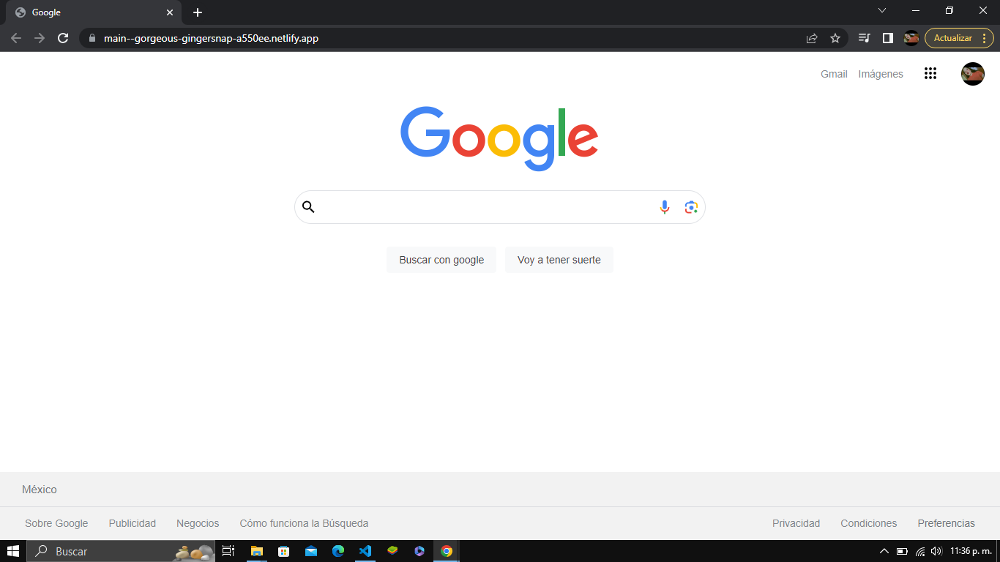

# clon-de-google
Clon de google: Proyecto realizado con la intención de aplicar los conocimientos obtenidos en el bootcamp de Tecnolochicas PRO Summer Camp.

Tienes la libertad de poder revisar este código para que pongas aprueba tus habilidades, explotes esa imaginación y así poder realizar cosas nuevas. ¡Inténtalo! 🤩

****

## ÍNDICE

* [1. Intro](https://github.com/ShellHa/clon-de-google/edit/main/README.md#1-intro)
* [2. Demo](https://github.com/ShellHa/clon-de-google/edit/main/README.md#2-demo)
* [3. ¿Qué contruirás?](https://github.com/ShellHa/clon-de-google/edit/main/README.md#3-qu%C3%A9-construir%C3%A1s)
* [4. Objetivos de Aprendizaje](https://github.com/ShellHa/clon-de-google/edit/main/README.md#4-objetivos-de-aprendizaje)
* [5. Requisitos](https://github.com/ShellHa/clon-de-google/edit/main/README.md#4-objetivos-de-aprendizaje)

## 1. Intro
HTML trabaja de la mano con CSS para crear las páginas web que usamos todos los días en el navegador. Incluso, este sitio web en donde estás viendo este contenido está construido con HTML y CSS (junto con otros elementos que conocerás más adelante). Para este primer proyecto, con los conocimientos que tienes de HTML y CSS realizarás la clonación de la interfaz de Google, sí, esa que ves cada que haces una búsqueda en su navegador, ¿aceptarás el reto? 🧐

## 2. Demo
Puedes entrar a ver el demo en este vínculo: https://main--gilded-tanuki-7e0c0b.netlify.app/ 

La idea es inspirarte con esta demostración de proyecto.

**¡Quizá no te quede idéntico o quizá te quede mucho mejor que este demo**, utiliza tu destreza y aprendizaje para que demuestres que tu futuro es ser un(a) programador(a) web.👩🏻💻👦🏻

  

## 3. ¿Qué construirás?
Este proyecto está enfocado en construir la interfaz estática de Google.

Se te pide que sea una sola página que contenga las secciones siguientes:

- **a. Header** Sección que involucra la foto del perfil, iconos, logo de Google y las áreas principales del sitio.

- **b. Main** Sección del contenedor para los elementos centrales de la página.

- **c. Footer** Sección que incluye hipervínculos al final de la página.

## 4. Objetivos de Aprendizaje 
El objetivo principal de este proyecto es desarrollar una interfaz utilizando HTML y CSS, en toda su aplicación.

Aplicarás:

- Etiquetas estándar HTML5.
  
- Estilos con CSS

## 5. Requisitos
Usa esta lista para saber los requisitos mínimos del proyecto:

## GENERAL 

Realizarse de manera individual

## UI

- [ ] Aplicar en todo el sitio HTML semántico de estándar no.5 (HTML5).
- [ ] Aplicar tipos de selectores en CSS.
- [ ] Sección `Header`, `main`, `footer`.  
